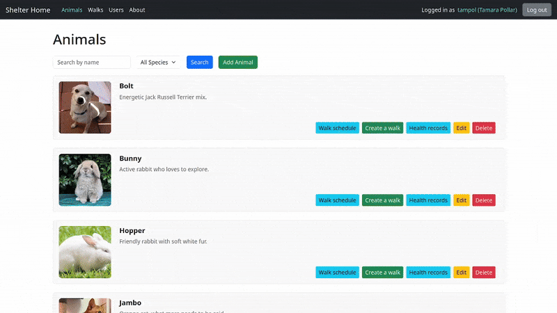

# Animal Shelter Information System

Django-based web application designed to manage an animal shelter, including details about animals, their health records, and walking schedules. It supports roles such as administrators, caregivers, veterinarians, and volunteers, each with specific functionality.

## Features
### Administrator:

Manages user accounts and creates roles for caregivers and veterinarians. Oversees system operations and permissions.

### Caregiver:

Adds and updates animal records, schedules walks, and approves volunteer reservations. Maintains animal health and history.

### Veterinarian:

Maintains and updates animal health records, including vaccinations and treatments. Responds to caregiver requests for medical care.

### Volunteer:

Reserves animals for walking and tracks the history of their walks. Provides updates on animals’ condition after walks.

### Unregistered User:

Browses available animals and general shelter information without registration. Can view animal profiles and shelter details.

## Setup Instructions
### Prerequisites:
- Python 3.8+
- Django

### Installation
1. `git clone https://github.com/masterofannihilation/iis-2024`
2. `cd <project directory>`
3. `python -m venv venv`
4.  - Windows:
    `venv\Scripts\activate`
    - Linux: `source venv/bin/activate`
5. `pip install -r requirements.txt`

### Run
1.  - Windows:
    `venv\Scripts\activate`
    - Linux: `source venv/bin/activate`
2. `python manage.py makemigrations`
3. `python manage.py migrate`
4. `python manage.py runserver`
5. Access web application at `http://127.0.0.1:8000/`

## Authors
- Michal Krulich (https://github.com/MichaelTheSynthCat/iis-2024)
- Stanislav Letaši (https://github.com/stan-leetasi)
- Boris Hatala (https://github.com/masterofannihilation)
